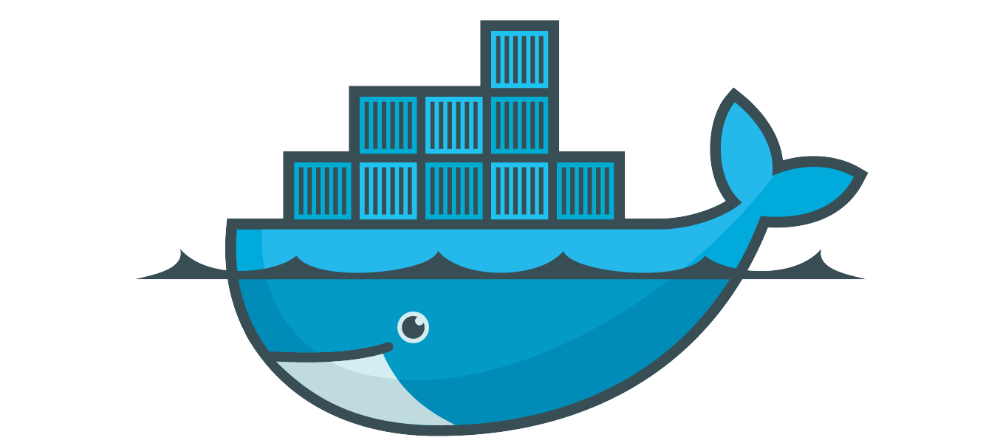
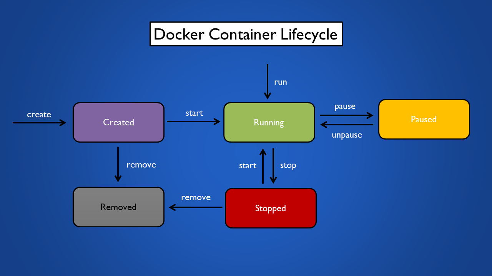

<!-- @format -->

# 💻Docker Fundamentals and Advanced Techniques💻



Welcome to **Docker Fundamentals and Advanced Techniques.** This guide is designed to help you learn Docker, whether you're a beginner or looking to expand your skills.

# Introduction

## What is **Docker?**

Docker is a tool that allows you to create, deploy, and run applications by using containers.
Using docker you can run your software on different **systems and environments** like a development environment, a production environment. And, the software will run consistently, regardless of what kind of environment it's on.

Docker lets you package and run applications in isolated environments called containers. This isolation allows you to run multiple containers at the same time on a single host. Containers are lightweight and include everything needed to run the application, so they don't depend on the host's setup. You can share containers with others, ensuring they work the same way for everyone.

## What is Docker Good For?

**Easy and Reliable Application Delivery**

Docker helps developers build and share applications smoothly. It keeps everything consistent across different stages of development, making it perfect for continuous integration and delivery.

**Here’s How it Works:**

- Developers write code and share it using Docker.
- They test their code in a controlled environment.
- If they find any issues, they fix them and retest.
- Once everything works perfectly, they can quickly deploy the application.

## Docker Architecture


## Quick Terminology Check

**Docker client**

- The Docker client (docker) is the primary way that many Docker users interact with Docker. When you use commands such as docker run, the client sends these commands to dockerd (daemon), which carries them out. The docker command uses the Docker API. The Docker client can communicate with more than one daemon.

**Docker daemon**

- The Docker daemon (dockerd) listens for Docker API requests and manages Docker objects
- It's responsible for managing Docker containers.

**Docker image**

- A Docker image is like a **snapshot of your application**. It contains all the **files and dependencies needed to run your application**. Think of it as a packaged-up version of your software that can be easily transported and run on any machine that has Docker installed. Images are built from a Dockerfile, which contains instructions on how to assemble the image.

**Docker container**

- A Docker container is like a running instance of your application. **It's created from a Docker image and contains everything needed to run your application, including the code, runtime, libraries, and dependencies.** Containers are isolated environments, which means they run independently of the host system and other containers. They're lightweight, portable, and can be easily moved between different environments.

**Docker Registries**

- A Docker registry stores Docker images. **Docker Hub** is a public registry that anyone can use, and **Docker looks for images on Docker Hub by default**. You can even run your own private registry.
- When you use the docker pull or docker run commands, Docker pulls the required images from your configured registry. When you use the docker push command, Docker pushes your image to your configured registry.

## Docker Installation

Simplified installation steps for Docker on Ubuntu and Windows -

### Docker for Ubuntu

**1. Update package repository**

```bash
  sudo apt update
```

**2. Install dependencies**

```bash
  sudo apt install apt-transport-https ca-certificates curl software-properties-common
```

**3. Add docker GPG key**

```bash
  curl -fsSL https://download.docker.com/linux/ubuntu/gpg | sudo apt-key add -
```

**4. Add docker repository**

```bash
  sudo add-apt-repository "deb [arch=amd64] https://download.docker.com/linux/ubuntu $(lsb_release -cs) stable"
```

**5. Install docker engine**

```bash
  sudo apt update
```

```bash
  sudo apt install docker-ce
```

**6. Verify Docker Installation**

```bash
  sudo docker --version
```

### Docker for Windows

**1. Download docker desktop installer**

Go to the Docker Desktop for Windows page and download the installer.

**2. Run installer**

Run the downloaded installer and follow the installation instructions. Docker Desktop will install Docker Engine, Docker CLI client, Docker Compose, Docker Machine, and Docker Kubernetes.

**3. Start docker desktop**

Once installed, start Docker Desktop from the Start menu.

**4. Verify docker installation**

Open a command prompt and run

```bash
  docker --version
```

**5. Check the Docker Service Status**
Open **Windows PowerShell** and run the following command to see if the Docker service is running or stopped.

```bash
  Get-Service *docker*
```

- If the service is running, the output will show **`Status: Running`**.
- If the service is not running, the output will show **`Status: Stopped`**.

**6. Start the Docker Service (if it is stopped)**

If the Docker service is stopped, we need to run PowerShell with administrator privileges to start it.

1. Close your current PowerShell window.
2. Search for "PowerShell" in the Start Menu, right-click on it, and select "Run as administrator".
3. In the administrator PowerShell window, run the following command to start the service.

```bash
Start-Service -Name "com.docker.service"
```

After running this command, the Docker Engine should be started.

# Docker File

### What is Docker File?

This is a **text document that acts as a blueprint or recipe for creating a Docker image**. It contains a **series of instructions** that tell Docker what to include in the image, such as the operating system, libraries, and your application code.

```bash
      # Base image
      FROM ubuntu:latest

      # Metadata
      LABEL maintainer="yourname@example.com"

      # Environment variable
      ENV APP_NAME="ExampleApp"

      # Working directory
      WORKDIR /app

      # Copy file
      COPY source_file.txt /app/

      # Install dependencies
      RUN apt-get update && apt-get install -y curl vim

      # Expose port
      EXPOSE 8080

      # Health check
      HEALTHCHECK CMD curl --fail http://localhost:8080 || exit 1

      # Default command
      CMD ["echo", "Default command"]

      # Entrypoint
      ENTRYPOINT ["echo", "Starting container..."]
```

Frequently used Dockerfile Instructions:

**`FROM`** : Sets base/parent Image.

**`LABEL`** : Adds metadata to the image.

**`RUN`** : Creates new layer.

**`EXPOSE`** : Intend port to publish.

**`WORKDIR`** : Sets current working directory.

**`COPY`** : Copy file from one location to container. If spaces include quotes.

**`ENV`** : Set environment variables. Can be overridden by --env flag.

**`HEALTHCHECK`** : Checks the health of a container by running a command inside the container.Can be only one Healthcheck instruction in a Dockerfile.

**`CMD`** : Setting default command for container. It can be overridden.

**`ENTRYPOINT`** : Specify executable inside the container. It does not get overridden.

However, it can be overridden by --entrypoint flag.

# Docker Image

### What is Docker Image?

This is the end product created from the Dockerfile. It's a **read-only template** that encapsulates everything your application needs to run, including the operating system, libraries, and your application code. **Images are portable and can be shared and stored in repositories like Docker Hub.**


# Docker Image Commands

**Build and run docker image**

```bash
  docker -t build <image_name> path_to_dockerfile
```

```bash
  docker build -t <image_name> .
```

The **`.`** at the end specifies the context (current directory) where the Dockerfile is located.

### What is Docker tag?

A Docker tag is a **label that we apply to a Docker image to identify its version or variant**. Tags make it easier to manage and differentiate between different versions of an image.

Tags help us to keep track of different versions of our images, enabling us to specify which version we want to run or deploy.

**List of all image**

```bash
  docker image ls
```

**Pull an image from a registry**

```bash
  docker pull <image_name:tag>
```

**Show detailed information about an image**

```bash
  docker image inspect nginx
```

**Remove a local image**

```bash
  docker rmi <image_name>:tag
```

**Tag an image**

```bash
  docker tag source_image:tag new:image:tag
```

**Remove all unused Docker images**

```bash
  docker image prune -a
```

**Push an image to Docker Hub**

```bash
  docker push image_name:tag
```

# Docker Container

These section should help you manage Docker on your system efficiently.

### Docker Command Reference

**Check Installed Docker Version**

```bash
  sudo docker version
```

**Display System-wide Information**

```bash
  sudo docker info
```

**Check Docker Service Status**

```bash
  sudo systemctl status docker
```

**List Currently Running Docker Containers**

```bash
  sudo docker ps
```

**List All Docker Containers (including stopped ones)**

```bash
  sudo docker ps -a
```

**List Available Docker Images**

```bash
  sudo docker images
```

**Correct Command to List Running Containers**

```bash
  docker container list
```

### Lifecycle of a Docker container

The lifecycle of a Docker container involves several stages, including creation, running, stopping, and removal. Containers are instantiated from Docker images, operated as isolated instances, and can be halted or paused as necessary. Finally, when their purpose is fulfilled or they are no longer required, containers can be efficiently removed.



**Creates a new container but does not start it**

```bash
  docker create --name my-container nginx
```

Creates a new container named "my-container" using the Nginx image but does not start it.

**Docker start**

```bash
  docker start my-container
```

Starts the container named "my-container" that was previously created but stopped.

**Docker run**

```bash
  docker run --name my-container nginx
```

This command combines the process of creating and starting a container named "my-container" using the Nginx image in a single step.

**Docker pause/unpause**

```bash
  docker pause my-container
```

```bash
  docker ps --filter "name=my-container"
```

```bash
  docker unpause my-container
```

**Docker stop**

```bash
  docker stop my-container
```

**Docker remove**

```bash
  docker rm my-container
```

**Run a container from an image**

```bash
  docker run nginx
```

**Run a command inside a running container**

```bash
  docker exec my-nginx ls /usr/share/nginx/html
```

**Display detailed information about a container**

```bash
  docker inspect my-container
```

**Stop a running container via name**

```bash
  docker stop my-container
```

**Stop all running container**

```bash
  docker container stop $(docker container ps -q)
```

**Start a stopped container vi ID**

```bash
  docker start 1662fbp18011593
```

**Restart a container**

```bash
  docker restart 1662fbp18011593
```

**Restart after 10 second**

```bash
  docker restart -t 10 1662fbp18011593
```

**Remove multiple containers**

```bash
  docker rm 1662pcs18011593 161w80asdf351lsm
```

**Remove all containers**

```bash
  docker rm $(docker ps -aq)
```

**Remove all containers forcefully**

```bash
  docker rm container_id --force
```

### Container Naming & Identificatioon

**Run a container with Name**

```bash
  docker container run --name <container_name> nginx
```

**Running a container in the detached mode**

```bash
  docker container run -d –name <container_name>
```

This is used to start a new container in detached mode, which means the container runs in the background and does not block terminal.

**Rename a container**

```bash
  docker rename my-nginx new-nginx
```

### Container Logs and Stats

**Display the logs of a container**

```bash
  docker logs <containerID>
```

**Display a live stream of container resource usage statistics**

```bash
  docker stats <containerID>
```

**Check specific container log runtime**

```bash
  docker exec 266 cat /var/log/nginx/access.log
```

**Remove all stopped containers**

```bash
  docker container prune
```

You will be prompted to confirm the action. To skip the confirmation prompt, use the **-f** or **--force** flag

```bash
  docker container prune -f
```

_**Note :** The key combination **`Ctrl + P + Q`** is used to detach from a running Docker container without stopping it._

### Why a Docker container exits?

Docker containers are like tasks—they start running when they have something to do and stop when they're done. **They're designed to run a specific job or process, and once that job is finished, the container stops**. So, containers run only as long as the task inside them is running.

### How to Keep the Container Running?

**Run the container with an interactive shell that keeps running**

```bash
  docker run -it –name <container name> image_name
```

### Container Interaction

Opens a shell inside an existing container

```bash
  docker container run -it ubuntu
```

Starts a new container with an interactive shell

**Check container host name**

```bash
  docker container exec b15948926sheb4 hostname
```

**Run an interactive shell inside a container**

```bash
  docker container exec -it 1662pcs4589ddf /bin/bash
```

Opens a shell inside an existing container.

_exec - Executes commands inside Docker containers_
**Copy from container to host**

```bash
  docker cp <container_id_or_name>:<container_path> <host_path>
```

**Copy from host to container**

```bash
  docker cp <host_path> <container_id_or_name>:<container_path>
```

**Remove all stopped containers**

```bash
  docker container prune
```

# CMD vs Entrypoint

In Docker, both **CMD and ENTRYPOINT are instructions used in a Dockerfile to specify the command that should be run when a container starts**. They might seem similar, but there's a key difference in how they behave:

### CMD:

- Defines the default arguments for the process specified by ENTRYPOINT (if ENTRYPOINT is set).
- **Can be overridden** by arguments provided during `docker run`.
- Think of it as the **default settings** for the main program.
- If multiple CMD instructions are specified in a Dockerfile, only the last one takes effect.

**Example :**

```bash
  FROM ubuntu
  CMD ["echo", "Hello, World!"]
```

Here, we have passed as parameter Hello World for CMD that prints after container start. Here, we override the default value with **Hi!**

```bash
  docker run ubuntu-test echo 'Hi'
```

### Entrypoint

- Sets the executable or command to be run when the container starts.
- **Cannot be overridden** by arguments provided during `docker run`.
- It makes the container **behave like an executable**.
- Think of it as the core program the container always executes.
- If multiple ENTRYPOINT instructions are specified in a Dockerfile, only the last one takes effect

**Example :**

```bash
  FROM ubuntu
  RUN apt-get update
  ENTRYPOINT ["echo", "Hello from Docker!!"]
```

It worked the same as CMD but when we have passed parameters will be see difference.

```bash
docker run -it ubuntu-test:latest 'Hello from AWS!!'
```

We have passed parameters but the executable hasn’t overridden and also added a new parameter with the old parameter.

### Using CMD & Entrypoint together

It's common practice to use both ENTRYPOINT and CMD together. ENTRYPOINT defines the main program, and CMD provides default arguments for it.

**Example :**

```bash
  FROM ubuntu
  RUN apt-get update
  ENTRYPOINT ["echo", "Hi!!"]
  CMD ["User"]
```

Build a new image from the modified Dockerfile and run a container. It will print **H!! User**

Let's pass parameters to the docker run command.

```bash
  docker run -it ubuntu-test  Docker
```

The output has now changed to `Hi!! Docker`

### When to use?

- **Use CMD** if you want the option to override the command when running the container.
- **Use ENTRYPOINT** if you want the command to always run and not be overridden.
- **Use both ENTRYPOINT (for the command) and CMD (for default arguments)** to set a fixed command with flexible default parameters.

# Docker Ignore

The `.dockerignore` file is used to specify files and directories that should be **excluded from the Docker build context**. This helps to reduce the size of the build context and avoid sending unnecessary files to the Docker daemon.

### Why Use `.dockerignore`?

- **Reduce Build Context Size :** Exclude files and directories that are not needed for the Docker image, making the build process faster.
- **Improve Security :** Prevent sensitive files (e.g., configuration files with secrets) from being included in the image.
- **Optimize Caching :** Excluding files that change frequently can help leverage Docker’s build cache more effectively.

Create a `.dockerignore` File. Place a `.dockerignore` file in the root of your project directory (the same location as your Dockerfile).

**Example `.dockerignore` File**

```bash
  # Ignore node_modules directory
  node_modules

  # Ignore logs
  logs
  *.log

  # Ignore temporary files
  tmp
  *.tmp

  # Ignore Git files
  .git
  .gitignore

  # Ignore Dockerfile itself
  Dockerfile

  # Ignore environment variables file
  .env
```

# Docker Volume

Docker volumes are used to **manage data persistence in Docker containers**. They allow data to be **stored outside the container's filesystem**, ensuring that the **data is not lost when the container is removed or recreated**.

### Why Use Docker Volumes?

- **Data Persistence :** Keep data even if the container is deleted.
- **Data Sharing :** Share data between multiple containers.
- **Decoupling Data and Container :** Separate data from the container's lifecycle.

### Types of Docker Volumes

- **Named Volumes :** Managed by Docker, and Docker takes care of their location.
- **Anonymous Volumes :** Created when you use -v or --mount without specifying a volume name.
- **Host Volumes (Bind Mounts) :** Use a directory or file from the host filesystem.

### Docker Volumes Command

**Create a named volume**

```bash
   docker volume create volume_name
```

**List all volumes**

```bash
   docker volume ls
```

**Inspect details of a volume**

```bash
   docker volume inspect volume_name
```

**Remove a volume**

```bash
  docker volume rm volume_name
```

**Remove all unused Docker volumes**

```bash
  docker volume prune
```

**Run a container with a volume**

```bash
   docker --name -v run container_name volume_name:/path/in/container image_name:tag
```

**Copy files between a container and a volume**

```bash
   docker cp local_file_or_directory container_name:/path/in/container
```

### Create Nginx volume and run Nginx Pod with attached volume inside of Nginx Pod

```bash
   docker volume create my-volume
```

```bash
   docker run -d -p 8080:80 --name nginx-server -v web-data:/usr/share/nginx/html nginx
```


`/usr/share/nginx/html` is the default directory where nginx serves static files. By mounting a volume here, you can persist the website data and share it between different containers or with the host.

### Bind Mount

A bind mount in Docker is a method of **mounting a directory or file** from the **host filesystem into a container**.

This **allows the container to access and use files from the host** as if they were part of the container's filesystem. Bind mounts are useful for **sharing data between the host and the container**, as well as for scenarios where you need the container to interact with files on the host in real-time.

**Run a container with a bind mount**

```bash
   docker run -d -p 8080:80 --name container-name -v /path/on/host:/usr/share/nginx/html nginx
```

`/path/on/host` is the absolute path to the directory on the host.

`/usr/share/nginx/html` is the path in the container where the directory is mounted.

Bind mounts provide a powerful and flexible way to **share data between the host and Docker containers**, making them ideal for development, testing, and situations where you need persistent and accessible storage.

# Docker Namespace

Docker namespaces are a fundamental feature that provides process-level isolation and resource management for containers. By leveraging namespaces, Docker ensures that containers are isolated from each other and from the host system, enabling efficient and secure deployment of applications in a variety of environments.

- **Purpose :** Namespaces create isolated environments for processes in Docker containers.

- **Isolation :** Each container has its own world for processes, networks, files, etc., so they don't interfere with each other.

- **Benefits :** Keeps things organized, secure, and efficient when running multiple containers on the same machine.

- **Bottom Line :** Docker namespaces ensure that containers play nicely together, without stepping on each other's toes.

# Docker Networking

**Docker networking allows containers to communicate with each other and the outside world**. It acts like a virtual network within the host system, allowing containers to connect and interact with each other, as well as potentially reach external services.

### Docker Networking Command

**Run a container with port mapping**

```bash
  docker container run -p container_name host_port:container_port image_name
```

**List all Network**

```bash
  docker network ls
```

**Inspect details of a network**

```bash
  docker inspect network network_name
```

**Connect a container to a network**

```bash
  docker connect network network_name container_name
```

**Disconnect a container from a network**

```bash
  docker disconnect network network_name container_name
```

# Docker Network Drivers

Docker comes with six built-in network drivers that provide core networking functionality. These drivers enable Docker containers to communicate with each other and with external networks.

### Bridge Driver

The **default network driver** that creates a private internal network on the host, allowing containers to communicate with each other and the external network via NAT

```bash
  docker network create --driver=bridge network_name
```

```bash
  docker run --network=created_network_name --name=container_name image_name
```

```bash
  docker inspect -f '{{range .NetworkSettings.Networks}}{{.IPAddress}}{{end}}' created_container_name
```

This command retrieve the IP address of created container

**172.18.0.0/16 is the default subnet used by Docker's bridge network.** This means that by default, when you run a Docker container without specifying a custom network, it gets assigned an IP address from this subnet (typically in the range of 172.18.0.2 to 172.18.255.254), but you can customize network configurations.

### Host Driver

The **host network driver** in Docker provides a way to run containers that share the networking namespace of the Docker host machine.

- Containers use the host's network directly.
- No network isolation between containers.
- Bind them to the same host port 80.

```bash
  docker run --network=host -d --name=container_name image_name
```

### IPvlan Driver

The **ipvlan driver** creates Docker containers that share Layer 2 (Ethernet) networking with the host machine, enabling direct communication.

- Configures sub-interfaces with unique MAC and IP addresses.
- Containers can directly connect to the physical network.

```bash
   docker network create -d ipvlan --subnet=192.168.1.0/24 --gateway=192.168.1.1 -o ipvlan_mode=l2 network_name
```

```bash
   docker run --network=network_name -d --name=container_name nginx
```


We can customize the subnet and gateway value.

### MacVlan Driver

Creates sub-interfaces with unique MAC and IP addresses. Containers appear as individual devices on the network.

```bash
   docker network create -d macvlan --subnet=192.168.10.0/24 --gateway=192.168.10.1 -o parent=eno1 network_name
```


```bash
   docker run --network=network_name -d --name=container_name image_name
```

### Null Driver

Provides an isolated environment where containers can't communicate.Useful for scenarios requiring complete network isolation.

```bash
   docker run --network=none -d --name=container_name image_name
```

### Overlay Driver

Enables multi-host networking in Docker Swarm. Uses overlay networks for communication across different hosts.

```bash
   docker network create --driver=overlay mnetwork_name
```

```bash
   docker service create --network=network_name service_name
```

# Docker Compose

Docker Compose is a tool provided by Docker that allows you to define and **manage multi-container Docker applications**. It uses a **YAML file** to configure the application's services, networks, and volumes, making it easier to orchestrate the containers that make up your application stack.


### Key Features of Docker Compose

**Multi-container Orchestration :** Docker Compose simplifies the process of defining and running multiple interconnected containers that together form an application stack.

**Declarative YAML Syntax :** You define your application's services, networks, and volumes in a YAML file **(usually named docker-compose.yml)**. This **_file specifies how Docker containers should be built, configured, and linked together_**.

**Service Definition :** Each service in your application (e.g., web server, database, cache) is defined in the docker-compose.yml file. You can specify Docker images, environment variables, volumes, ports, and other configurations for each service.

**Networking :** **_Docker Compose automatically creates a default network for your application_**, allowing containers to communicate with each other securely. You can also define custom networks to control how containers connect.

**Volume Management :** You can define named volumes in Docker Compose to persist data generated by containers. Volumes ensure that data is retained even if containers are stopped or removed.

**Environment Variables and Secrets :** Docker Compose allows you to specify environment variables either directly in the YAML file or in separate _`.env`_ files. This makes it easy to manage configurations across different environments (development, testing, production).

### Benifits of Docker Compose

**Simplified application development :** Instead of managing individual containers, you define and run your entire application with a single command. This makes development, testing, and deployment significantly easier.

**Consistent environments :** A single configuration file ensures all your containers are set up identically regardless of the environment (development, staging, production). This promotes reproducibility and avoids inconsistencies.

**Multi-container management :** Docker Compose takes care of starting, stopping, rebuilding, and scaling all the containers that make up your application.

### Docker Compose Installation

- **Step 1 :** Ensure docker is installed

- **Step 2 :** Download the Latest Docker Compose Binary

  - You’ll use the curl command to download the Docker Compose binary from Docker’s GitHub repository.

```bash
   sudo curl -L "https://github.com/docker/compose/releases/download/1.29.2/docker-compose-$(uname -s)-$(uname -m)" -o /usr/local/bin/docker-compose
```

- **Step 3 :** Set Execution Permissions

  - After downloading, set the appropriate permissions to make the binary executable.

```bash
   sudo chmod +x /usr/local/bin/docker-compose
```

- **Step 4 :** Verify Installation

```bash
   docker-compose --version
```

Docker Compose is installed.

### What is `docker-compose.yml` file?

Docker Compose YAML file `(docker-compose.yml)` is a configuration file used by Docker Compose to define and **_manage multi-container Docker applications_**. It allows you to **describe the services, networks, and volumes that make up your application in a declarative manner, using YAML syntax**.

This file enables you to run a multi-container application with a single command, simplifying the orchestration and management of complex applications.

### Example of `docker-compose.yml` File with breakdown

```bash
  version: '3.8'

  services:
    web:
      image: nginx:latest
      ports:
        - "8080:80"
      volumes:
        - ./nginx.conf:/etc/nginx/nginx.conf
      networks:
        - frontend

    db:
      image: mysql:latest
      environment:
        MYSQL_ROOT_PASSWORD: example
      volumes:
        - db_data:/var/lib/mysql
      networks:
        - backend

  networks:
    frontend:
    backend:

  volumes:
    db_data:
```

**Breakdown :**

- **`version:'3.8'`** : Uses version 3.8 of the Docker Compose file format.
- **`services`** : Defines two services, `web` & `db`
  - **`web`**: Runs an NGINX web server
    - **`image`** : Uses the latest NGINX Docker image.
    - **`ports`** : Maps port 8080 on the host to port 80 in the container.
    - **`volumes`** : Mounts a custom NGINX configuration file.
    - **`networks`** : Connects to the frontend network.
  - **`db`** : Runs a MySQL database server.
    - **`image`** : Uses the latest MySQL Docker image.
    - **`environment`** : Sets the root password for MySQL.
    - **`volumes`** : Uses a named volume db_data to persist MySQL data.
    - **`networks`**: Connects to the backend network.
- **`networks`** : Defines two networks, frontend and backend, to manage service communication.
  - **`frontend`** : A network for the web service.
  - **`backend`** : A network for the db service.
- **`volumes`** : Defines a named volume db_data for persisting data used by the db service.

By default, compose sets up a single network for your app if you didn't specify your own networks with top-level "networks" key.

**N.B** : Be carefull with the indentations in YAML

### Why yaml file support json file also?

YAML files support JSON because YAML is a **superset** of JSON, meaning any valid JSON file is also a valid YAML file.

- **YAML as a superset of JSON :** YAML (YAML Ain't Markup Language) is designed to be human-readable and concise, allowing for easy representation of complex data structures. It includes additional features like comments and more flexible syntax compared to JSON.

- **JSON compatibility :** YAML supports JSON syntax natively. This means you can write JSON data directly into a YAML file and it will be interpreted correctly.

**Example :**
Consider the following JSON data

```bash
  {
    "name": "Pritam",
    "age": 25,
    "city": "Chattogram",
    "skills": ["Docker", "AWS","Linux"],
    "contact":
      {
      "email": "pritamchakrabortyshuvo@gmail.com",
      "phone": "123-456-7890"
      }
  }
```

You can represent the same data in YAML format like this:

```bash
  name: Pritam
  age: 25
  city: Chattogram
  skills:
    - Docker
    - AWS
    - Linux
  contact:
  email: pritamchakrabortyshuvo@gmail.com
  phone: 123-456-7890
```

YAML is often more readable and easier to write compared to JSON, especially for complex data structures

But docker is also support json file too.

**Example :**

```bash
   docker compose -f docker-compose.json up -d
```

### Docker Compose Commands

**Create and start containers**

```bash
   docker-compose up -d
```

This command reads the **`docker-compose.yml`** file & starts the defined services in the background.

**Stop and remove containers**

```bash
   docker-compose down
```

This command stops & removes the containers, networks, and volumes defined in the **`docker-compose.yml`** file.

**Build or rebuild services**

```bash
   docker-compose build
```

This command builds or rebuilds the Docker images for the services defined in the **`docker-compose.yml`** file.

**List containers for a specific Docker Compose project**

```bash
   docker-compose ps
```

This command lists the containers for the services defined in the **`docker-compose.yml`** file.

**View logs for services**

```bash
   docker-compose logs
```

This command shows the logs for all services defined in the **`docker-compose.yml`** file.

**Scale services to a specific number of containers**

```bash
   docker up -d --scale compose service_name=number_of_containers
```

Runs multiple containers of a service.

**Run a one-time command in a service**

```bash
   docker-compose run service_name compose command
```

Example :

```bash
  docker run web npm compose install
```

**View details of a service**

```bash
   docker-compose ps service_name
```

Provides detailed information about a specific service.

**Start Docker Compose with Custom Configuration**

```bash
   docker-compose -f docker-compose2.yml up -d
```

The command `docker-compose -f docker-compose2.yml up -d` is used to specify a different Docker Compose YAML file `(docker-compose2.yml)` and start the services defined within it in detached mode.

**N.B :** _When you change your `docker-compose.yml` file and run `docker-compose up` again, Docker Compose applies the updated configuration, rebuilds images if necessary, and recreates containers to reflect the changes. This ensures that your containers are running with the latest settings and configurations you've defined._

**Create Containers without start them**

```bash
  docker-compose create
```

This command will create the containers but will **not create the network.**

**Start the stopped container**

```bash
  docker-compose start
```

**Stop the running container**

```bash
  docker-compose stop
```

**Find host port for container**

```bash
  docker-compose port service_name 80
```

Provides a quick and easy way to check how your services are exposed on the host machine.

**Pull the latest versions of the images from the Docker registry**

```bash
  docker-compose pull
```
